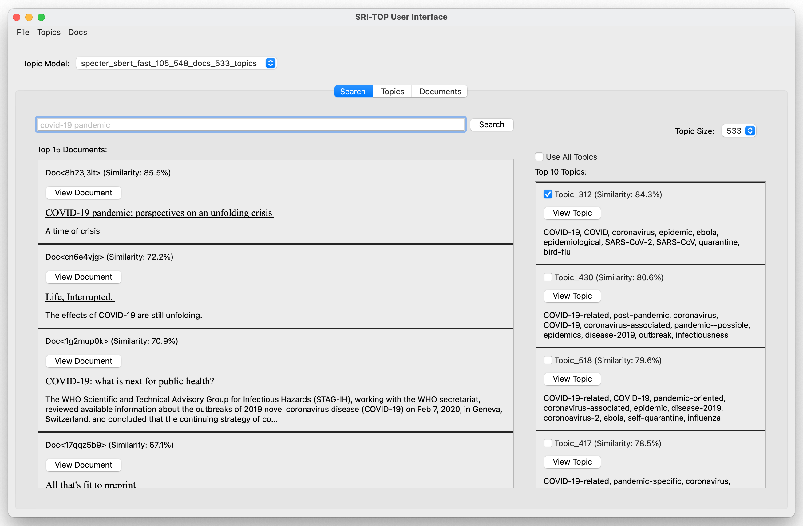
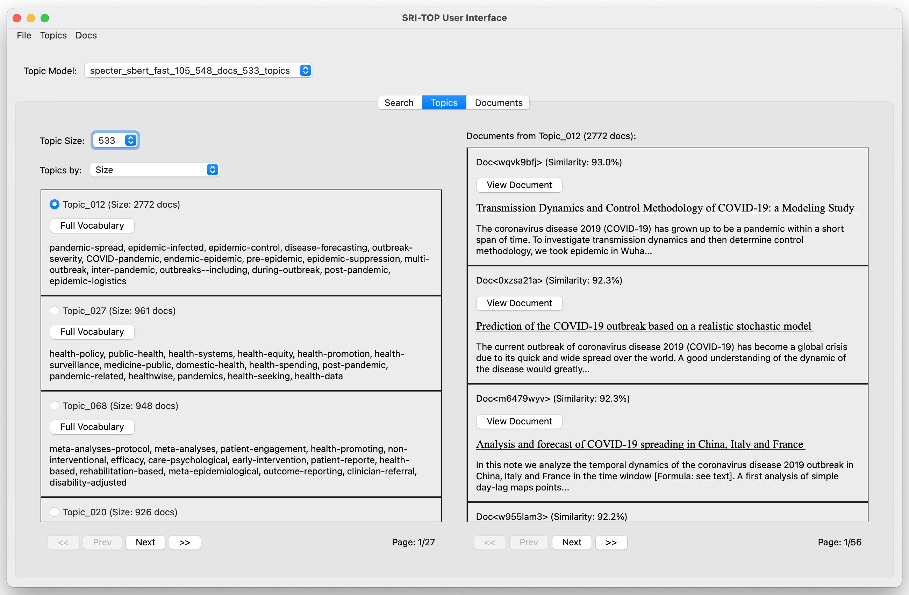
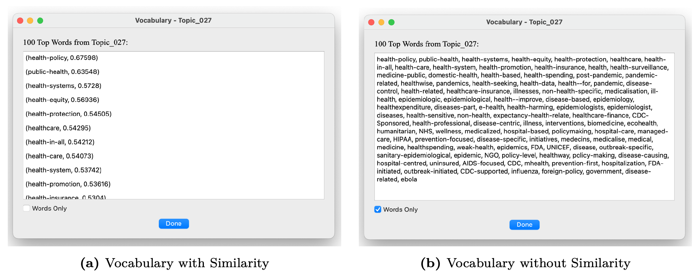
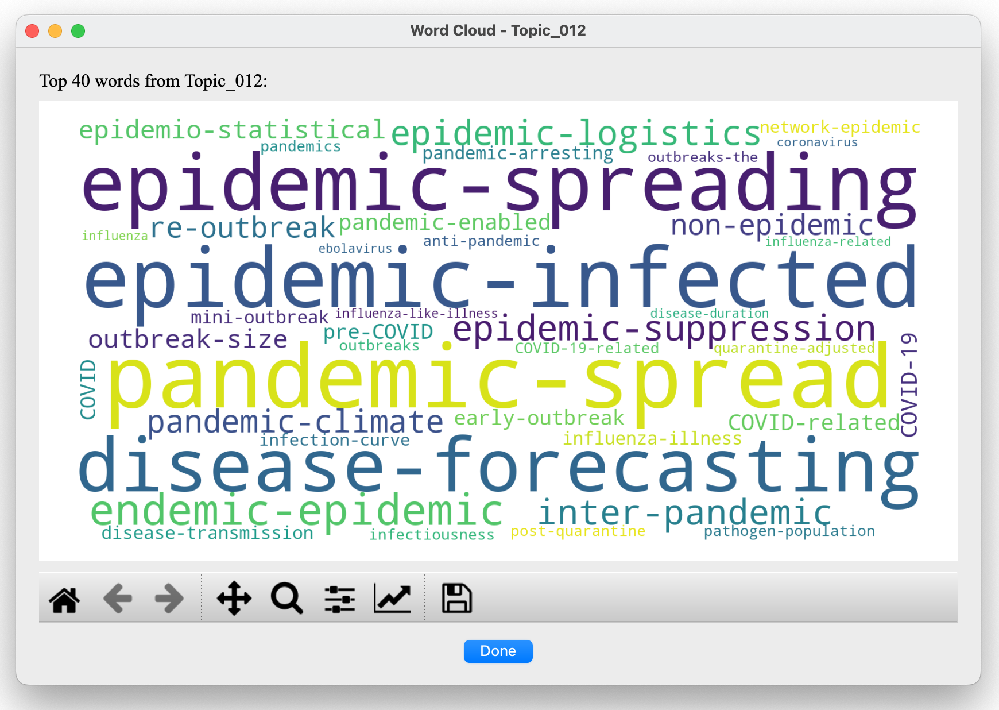
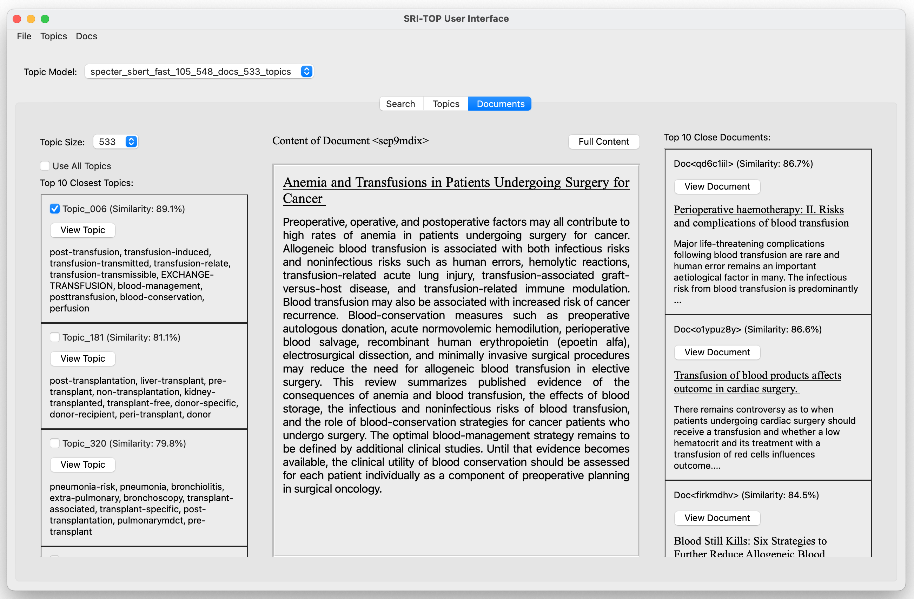

# SRI-TOP: Information Retrieval System based on Topics 

App developed for the Diploma Work of my Bachelor's degree in Computer Science, 
at the Faculty of Mathematics and Computer Science in the University of Havana, 
Cuba.

## Thesis' Abstract

Information retrieval is one of the main ways to access information today. In 
order to guarantee access to quality information when necessary, innovative 
techniques must be developed that can be adapted to the needs of the user. In 
this work we develop an Information Retrieval System based on Topics (SRI-TOP). 
For the construction of this system, we used a Model with Distributed 
Representations of Topics (Top2Vec) using the SPECTER and Sentence-BERT models 
for the representation of the documents. The built Topic Models improve the state 
of the art, obtaining more satisfactory results compared to previous models in 
terms of the quality and descriptive capacity of their topics. As a visual 
interface for SRI-TOP, we created an application that allows queries and user 
interaction with the topics and documents in the corpus.

## Application

SRI-TOP was built with a visual interface that allows users to perform queries, 
examine the content of documents, and explore the topics found in the corpus by 
the IR system. In the application developed for our system, specialized tabs were 
built for each of the tasks that can be performed in the system. The tabs are 
_Search_, _Topics_, and _Documents_.

Before making a query, the user can select the corpus and Topic Model that they 
wish to use with SRI-TOP, also having the option of controlling the number of 
topics. This way, the user can more easily navigate the topics in the collection 
of documents, being able to select more general or more specific topics depending 
on their needs.

### Searching Information

To perform queries on the system, we can use the _Search_ Tab. In this tab, SRI-TOP 
shows the topics most similar to the query made by the user, so they can select 
the topics where he wants to find the most relevant documents. The user has the 
options of searching for documents in one topic, several topics, or all the topics 
present in the corpus. Both the topics and the documents in the results are ranked 
by their similarity to the query. The search of the most relevant documents for 
the query is carried out using the documents corresponding to the selected topics. 
By default, the most similar topic to the query is selected.



### Exploring Topics

The user, if desired, can explore the topics within the document collection by 
using the _Topics_ tab. Topics can be ordered by their size, homogeneity, 
information gain (PWI). For each topic, we display their assigned documents 
ranked most to least similar.



Another option available on the _Topics_ tab is to see the complete vocabulary 
of a topic. The full vocabulary of a topic can be viewed in text form, with the 
option to include or not the similarities between the words and the topic.



The topic's words can also be displayed in the form of a Word Cloud. To activate 
this option, _Word Clouds_ must be activated in the _Topics_ menu. The words size 
depends on their similarity to the topic they describe.



### Exploring Documents

In the _Documents_ Tab we can see the content of a document, and see its most 
similar topics and documents. In the center of this tab, we display the title 
and abstract of the document. On the left we can see its most similar topics, and
on the right its most similar documents from the pool of documents that belong 
to the selected topics displayed on the left. These lists of relevant topics and 
documents in the relation with the current document allow the user to easily 
expand their search once a document of interest is found.



## Citation

Please cite my [thesis](project_thesis/thesis_gelin_eguinosa.pdf) as:

```
@mastersthesis{eguinosa:2022,
  author      = {Eguinosa Rosique, Gelin and Garcia Garrido, Luciano},
  title       = {{SRI-TOP: Sistema de Recuperación de Información Basado en Tópicos}},
  school      = {Facultad de Matematica y Computacion, Universidad de La Habana},
  type        = {Diploma de Tesis de Licenciatura en Ciencias de la Computacion},
  address     = {La Habana, Cuba},
  month       = {dec},
  year        = {2022}
}
```
